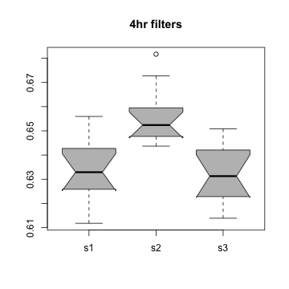
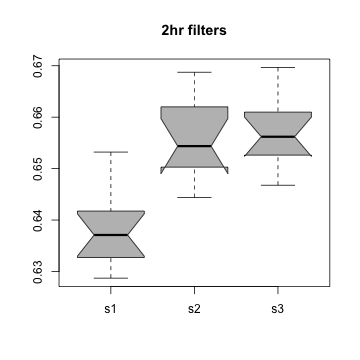
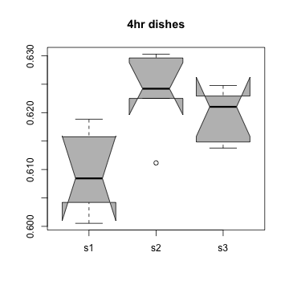
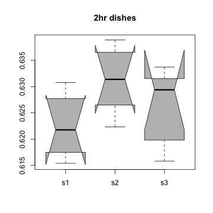
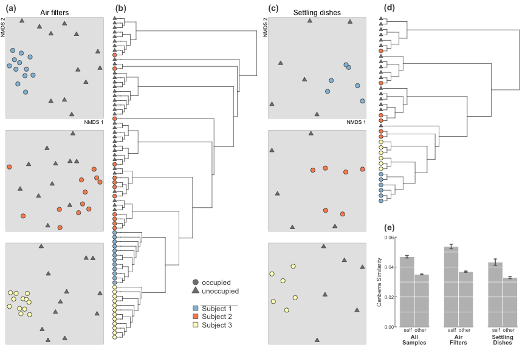
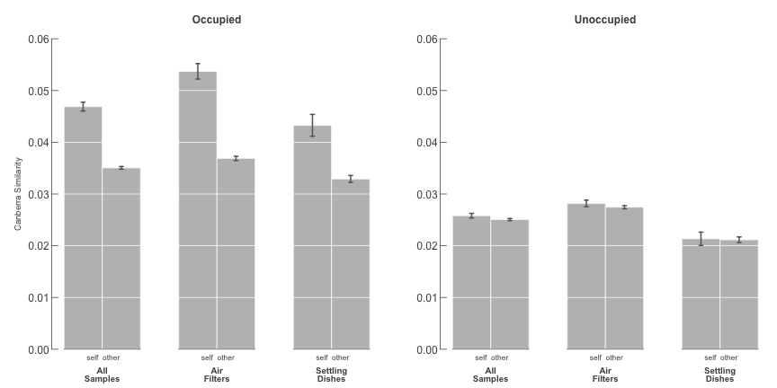
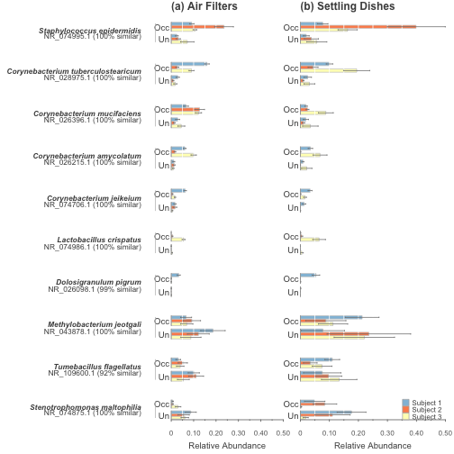

# Personal Microbial Cloud

## Tables and Figures

Load in data from pb_analysis.Rmd


```r
load("../data/pb_analysis_to_figures.RData")
load("../data/taxon_analysis.RData")
source("../data/pb_functions_for_manuscript.R")
```


Load packages


```r
library(vegan)
library(labdsv)
library(ape)
library(xtable)
```


Unpack list of groups.


```r
for (i in 1:length(names(groups))) {
    assign(names(groups)[i], unlist(groups[[i]]))
}
```


Info for manuscript: 

* 5.0357 &times; 10<sup>6</sup> total sequences
* 234209 total OTUs
* 300 total samples
* 2.11 &times; 10<sup>5</sup> rarefied sequences (1000 per sample)
* 19226 rarefied OTUs
* 211 rarefied samples

What percentage were _Methylobacterium_ sp. sequences?

```r
sum(pb.1000[, "234992"])/sum(pb.1000) * 100
```

```
## [1] 13.34
```


How many samples were dominated by this OTU?

```r
meth <- 0
for (i in 1:nrow(pb.1000)) {
    if (names(rev(sort(pb.1000[i, ])))[1] == "234992") {
        meth <- meth + 1
    }
}
meth/nrow(pb.1000)
```

```
## [1] 0.327
```

```r
rm(meth, i)
```


Most dominant in occupied samples


```r
names(rev(sort(colSums(pb.1000[pb.map$location == "occ", ]))))[1:3]
```

```
## [1] "25506"  "234992" "94008"
```

```r
sum(pb.1000[pb.map$location == "occ", "25506"])/sum(pb.1000[pb.map$location == 
    "occ", ])
```

```
## [1] 0.1482
```

```r
sum(pb.1000[pb.map$location == "unocc", "25506"])/sum(pb.1000[pb.map$location == 
    "unocc", ])
```

```
## [1] 0.03351
```


Create color shortcuts


```r
s1.col <- "#91BFDB"
s2.col <- "#FC8D59"
s3.col <- "#FFFFBF"
```


Put plotting options in mapping table.


```r
# assign colors
pb.map$bg[pb.map$person == "s1"] <- "#91BFDB"  # blue
pb.map$bg[pb.map$person == "s2"] <- "#FC8D59"  # orange
pb.map$bg[pb.map$person == "s3"] <- "#FFFFBF"  # yellow
pb.map$bg2 <- pb.map$bg
pb.map$bg2[pb.map$location == "unocc"] <- "gray50"
pb.map$bor <- "gray30"
```


------------------

#### PERMANOVA

All trials together, regardless of person or collection method. 


```r
all.occ.v.unocc <- adonis(pb.can ~ pb.map$location)
dim(pb.map)
```

[1] 211   9

```r
print(xtable(all.occ.v.unocc$aov.tab), type = "html")
```

<!-- html table generated in R 3.0.1 by xtable 1.7-1 package -->
<!-- Fri Jan 17 17:45:21 2014 -->
<TABLE border=1>
<TR> <TH>  </TH> <TH> Df </TH> <TH> SumsOfSqs </TH> <TH> MeanSqs </TH> <TH> F.Model </TH> <TH> R2 </TH> <TH> Pr(&gt F) </TH>  </TR>
  <TR> <TD> pb.map$location </TD> <TD align="right"> 1 </TD> <TD align="right"> 1.04 </TD> <TD align="right"> 1.04 </TD> <TD align="right"> 2.20 </TD> <TD align="right"> 0.01 </TD> <TD align="right"> 0.0010 </TD> </TR>
  <TR> <TD> Residuals </TD> <TD align="right"> 209 </TD> <TD align="right"> 98.53 </TD> <TD align="right"> 0.47 </TD> <TD align="right">  </TD> <TD align="right"> 0.99 </TD> <TD align="right">  </TD> </TR>
  <TR> <TD> Total </TD> <TD align="right"> 210 </TD> <TD align="right"> 99.57 </TD> <TD align="right">  </TD> <TD align="right">  </TD> <TD align="right"> 1.00 </TD> <TD align="right">  </TD> </TR>
   </TABLE>


All 4hr together regardless of person or method.


```r
all.4.occ.v.unocc <- adonis(as.dist(as.matrix(pb.can)[pb.map$duration == 4, 
    pb.map$duration == 4]) ~ pb.map$location[pb.map$duration == 4])
print(xtable(all.4.occ.v.unocc$aov.tab), type = "html")
```

<!-- html table generated in R 3.0.1 by xtable 1.7-1 package -->
<!-- Fri Jan 17 17:45:21 2014 -->
<TABLE border=1>
<TR> <TH>  </TH> <TH> Df </TH> <TH> SumsOfSqs </TH> <TH> MeanSqs </TH> <TH> F.Model </TH> <TH> R2 </TH> <TH> Pr(&gt F) </TH>  </TR>
  <TR> <TD> pb.map$location[pb.map$duration == 4] </TD> <TD align="right"> 1 </TD> <TD align="right"> 0.88 </TD> <TD align="right"> 0.88 </TD> <TD align="right"> 1.88 </TD> <TD align="right"> 0.02 </TD> <TD align="right"> 0.0010 </TD> </TR>
  <TR> <TD> Residuals </TD> <TD align="right"> 104 </TD> <TD align="right"> 48.71 </TD> <TD align="right"> 0.47 </TD> <TD align="right">  </TD> <TD align="right"> 0.98 </TD> <TD align="right">  </TD> </TR>
  <TR> <TD> Total </TD> <TD align="right"> 105 </TD> <TD align="right"> 49.59 </TD> <TD align="right">  </TD> <TD align="right">  </TD> <TD align="right"> 1.00 </TD> <TD align="right">  </TD> </TR>
   </TABLE>


All 2hr together regardless of person or method.


```r
all.2.occ.v.unocc <- adonis(as.dist(as.matrix(pb.can)[pb.map$duration == 2, 
    pb.map$duration == 2]) ~ pb.map$location[pb.map$duration == 2])
print(xtable(all.2.occ.v.unocc$aov.tab), type = "html")
```

<!-- html table generated in R 3.0.1 by xtable 1.7-1 package -->
<!-- Fri Jan 17 17:45:22 2014 -->
<TABLE border=1>
<TR> <TH>  </TH> <TH> Df </TH> <TH> SumsOfSqs </TH> <TH> MeanSqs </TH> <TH> F.Model </TH> <TH> R2 </TH> <TH> Pr(&gt F) </TH>  </TR>
  <TR> <TD> pb.map$location[pb.map$duration == 2] </TD> <TD align="right"> 1 </TD> <TD align="right"> 0.67 </TD> <TD align="right"> 0.67 </TD> <TD align="right"> 1.41 </TD> <TD align="right"> 0.01 </TD> <TD align="right"> 0.0010 </TD> </TR>
  <TR> <TD> Residuals </TD> <TD align="right"> 103 </TD> <TD align="right"> 48.79 </TD> <TD align="right"> 0.47 </TD> <TD align="right">  </TD> <TD align="right"> 0.99 </TD> <TD align="right">  </TD> </TR>
  <TR> <TD> Total </TD> <TD align="right"> 104 </TD> <TD align="right"> 49.46 </TD> <TD align="right">  </TD> <TD align="right">  </TD> <TD align="right"> 1.00 </TD> <TD align="right">  </TD> </TR>
   </TABLE>


All petris together regardless of person.


```r
all.p.occ.v.unocc <- adonis(as.dist(as.matrix(pb.can)[pb.map$sampleType == "petri.dish", 
    pb.map$sampleType == "petri.dish"]) ~ pb.map$location[pb.map$sampleType == 
    "petri.dish"])
print(xtable(all.p.occ.v.unocc$aov.tab), type = "html")
```

<!-- html table generated in R 3.0.1 by xtable 1.7-1 package -->
<!-- Fri Jan 17 17:45:22 2014 -->
<TABLE border=1>
<TR> <TH>  </TH> <TH> Df </TH> <TH> SumsOfSqs </TH> <TH> MeanSqs </TH> <TH> F.Model </TH> <TH> R2 </TH> <TH> Pr(&gt F) </TH>  </TR>
  <TR> <TD> pb.map$location[pb.map$sampleType == "petri.dish"] </TD> <TD align="right"> 1 </TD> <TD align="right"> 0.63 </TD> <TD align="right"> 0.63 </TD> <TD align="right"> 1.32 </TD> <TD align="right"> 0.02 </TD> <TD align="right"> 0.0010 </TD> </TR>
  <TR> <TD> Residuals </TD> <TD align="right"> 69 </TD> <TD align="right"> 32.75 </TD> <TD align="right"> 0.47 </TD> <TD align="right">  </TD> <TD align="right"> 0.98 </TD> <TD align="right">  </TD> </TR>
  <TR> <TD> Total </TD> <TD align="right"> 70 </TD> <TD align="right"> 33.38 </TD> <TD align="right">  </TD> <TD align="right">  </TD> <TD align="right"> 1.00 </TD> <TD align="right">  </TD> </TR>
   </TABLE>


All filters together regardless of person.


```r
all.f.occ.v.unocc <- adonis(as.dist(as.matrix(pb.can)[pb.map$sampleType != "petri.dish", 
    pb.map$sampleType != "petri.dish"]) ~ pb.map$location[pb.map$sampleType != 
    "petri.dish"])
print(xtable(all.f.occ.v.unocc$aov.tab), type = "html")
```

<!-- html table generated in R 3.0.1 by xtable 1.7-1 package -->
<!-- Fri Jan 17 17:45:22 2014 -->
<TABLE border=1>
<TR> <TH>  </TH> <TH> Df </TH> <TH> SumsOfSqs </TH> <TH> MeanSqs </TH> <TH> F.Model </TH> <TH> R2 </TH> <TH> Pr(&gt F) </TH>  </TR>
  <TR> <TD> pb.map$location[pb.map$sampleType != "petri.dish"] </TD> <TD align="right"> 1 </TD> <TD align="right"> 0.90 </TD> <TD align="right"> 0.90 </TD> <TD align="right"> 1.92 </TD> <TD align="right"> 0.01 </TD> <TD align="right"> 0.0010 </TD> </TR>
  <TR> <TD> Residuals </TD> <TD align="right"> 138 </TD> <TD align="right"> 64.74 </TD> <TD align="right"> 0.47 </TD> <TD align="right">  </TD> <TD align="right"> 0.99 </TD> <TD align="right">  </TD> </TR>
  <TR> <TD> Total </TD> <TD align="right"> 139 </TD> <TD align="right"> 65.64 </TD> <TD align="right">  </TD> <TD align="right">  </TD> <TD align="right"> 1.00 </TD> <TD align="right">  </TD> </TR>
   </TABLE>


These are all for 4hr filters. 


```r
occ.v.unocc <- adonis(occ4f.can ~ occ4f.map$location)
person.v.unocc <- adonis(occ4f.can ~ occ4f.map$occ.person2)
person.v.eachother <- adonis(as.dist(as.matrix(occ4f.can)[occ4f.map$location == 
    "occ", occ4f.map$location == "occ"]) ~ subset(occ4f.map, occ4f.map$location == 
    "occ")$person)
only.unocc <- adonis(as.dist(as.matrix(occ4f.can)[occ4f.map$location == "unocc", 
    occ4f.map$location == "unocc"]) ~ subset(occ4f.map, occ4f.map$location == 
    "unocc")$person)
```


These are all for 4hr settling dishes. 


```r
occ.v.unocc.p <- adonis(occ4p.can ~ occ4p.map$location)
person.v.unocc.p <- adonis(occ4p.can ~ occ4p.map$occ.person2)
person.v.eachother.p <- adonis(as.dist(as.matrix(occ4p.can)[occ4p.map$location == 
    "occ", occ4p.map$location == "occ"]) ~ subset(occ4p.map, occ4p.map$location == 
    "occ")$person)
only.unocc.p <- adonis(as.dist(as.matrix(occ4p.can)[occ4p.map$location == "unocc", 
    occ4p.map$location == "unocc"]) ~ subset(occ4p.map, occ4p.map$location == 
    "unocc")$person)
```


```r
print(xtable(occ.v.unocc$aov.tab), type = "html")
```

<!-- html table generated in R 3.0.1 by xtable 1.7-1 package -->
<!-- Fri Jan 17 17:51:35 2014 -->
<TABLE border=1>
<TR> <TH>  </TH> <TH> Df </TH> <TH> SumsOfSqs </TH> <TH> MeanSqs </TH> <TH> F.Model </TH> <TH> R2 </TH> <TH> Pr(&gt F) </TH>  </TR>
  <TR> <TD> occ4f.map$location </TD> <TD align="right"> 1 </TD> <TD align="right"> 0.79 </TD> <TD align="right"> 0.79 </TD> <TD align="right"> 1.69 </TD> <TD align="right"> 0.02 </TD> <TD align="right"> 0.0010 </TD> </TR>
  <TR> <TD> Residuals </TD> <TD align="right"> 69 </TD> <TD align="right"> 32.13 </TD> <TD align="right"> 0.47 </TD> <TD align="right">  </TD> <TD align="right"> 0.98 </TD> <TD align="right">  </TD> </TR>
  <TR> <TD> Total </TD> <TD align="right"> 70 </TD> <TD align="right"> 32.92 </TD> <TD align="right">  </TD> <TD align="right">  </TD> <TD align="right"> 1.00 </TD> <TD align="right">  </TD> </TR>
   </TABLE>


Samples are significantly different when the room is occupied.


```r
print(xtable(person.v.unocc$aov.tab), type = "html")
```

<!-- html table generated in R 3.0.1 by xtable 1.7-1 package -->
<!-- Fri Jan 17 17:51:35 2014 -->
<TABLE border=1>
<TR> <TH>  </TH> <TH> Df </TH> <TH> SumsOfSqs </TH> <TH> MeanSqs </TH> <TH> F.Model </TH> <TH> R2 </TH> <TH> Pr(&gt F) </TH>  </TR>
  <TR> <TD> occ4f.map$occ.person2 </TD> <TD align="right"> 3 </TD> <TD align="right"> 2.06 </TD> <TD align="right"> 0.69 </TD> <TD align="right"> 1.49 </TD> <TD align="right"> 0.06 </TD> <TD align="right"> 0.0010 </TD> </TR>
  <TR> <TD> Residuals </TD> <TD align="right"> 67 </TD> <TD align="right"> 30.86 </TD> <TD align="right"> 0.46 </TD> <TD align="right">  </TD> <TD align="right"> 0.94 </TD> <TD align="right">  </TD> </TR>
  <TR> <TD> Total </TD> <TD align="right"> 70 </TD> <TD align="right"> 32.92 </TD> <TD align="right">  </TD> <TD align="right">  </TD> <TD align="right"> 1.00 </TD> <TD align="right">  </TD> </TR>
   </TABLE>


And there is a difference when you consider who was occupying the room.


```r
print(xtable(person.v.eachother$aov.tab), type = "html")
```

<!-- html table generated in R 3.0.1 by xtable 1.7-1 package -->
<!-- Fri Jan 17 17:51:35 2014 -->
<TABLE border=1>
<TR> <TH>  </TH> <TH> Df </TH> <TH> SumsOfSqs </TH> <TH> MeanSqs </TH> <TH> F.Model </TH> <TH> R2 </TH> <TH> Pr(&gt F) </TH>  </TR>
  <TR> <TD> subset(occ4f.map, occ4f.map$location == "occ")$person </TD> <TD align="right"> 2 </TD> <TD align="right"> 1.28 </TD> <TD align="right"> 0.64 </TD> <TD align="right"> 1.43 </TD> <TD align="right"> 0.08 </TD> <TD align="right"> 0.0010 </TD> </TR>
  <TR> <TD> Residuals </TD> <TD align="right"> 33 </TD> <TD align="right"> 14.78 </TD> <TD align="right"> 0.45 </TD> <TD align="right">  </TD> <TD align="right"> 0.92 </TD> <TD align="right">  </TD> </TR>
  <TR> <TD> Total </TD> <TD align="right"> 35 </TD> <TD align="right"> 16.06 </TD> <TD align="right">  </TD> <TD align="right">  </TD> <TD align="right"> 1.00 </TD> <TD align="right">  </TD> </TR>
   </TABLE>


And also a big difference when you compare the 3 people against one another. 

How about if we only look at the unoccupied side of the room? There should be a temporal diff, but we would expect the variation explained to be less than that when only looking at person.v.eachother. 


```r
print(xtable(only.unocc$aov.tab), type = "html")
```

<!-- html table generated in R 3.0.1 by xtable 1.7-1 package -->
<!-- Fri Jan 17 17:51:35 2014 -->
<TABLE border=1>
<TR> <TH>  </TH> <TH> Df </TH> <TH> SumsOfSqs </TH> <TH> MeanSqs </TH> <TH> F.Model </TH> <TH> R2 </TH> <TH> Pr(&gt F) </TH>  </TR>
  <TR> <TD> subset(occ4f.map, occ4f.map$location == "unocc")$person </TD> <TD align="right"> 2 </TD> <TD align="right"> 0.96 </TD> <TD align="right"> 0.48 </TD> <TD align="right"> 1.02 </TD> <TD align="right"> 0.06 </TD> <TD align="right"> 0.1420 </TD> </TR>
  <TR> <TD> Residuals </TD> <TD align="right"> 32 </TD> <TD align="right"> 15.11 </TD> <TD align="right"> 0.47 </TD> <TD align="right">  </TD> <TD align="right"> 0.94 </TD> <TD align="right">  </TD> </TR>
  <TR> <TD> Total </TD> <TD align="right"> 34 </TD> <TD align="right"> 16.07 </TD> <TD align="right">  </TD> <TD align="right">  </TD> <TD align="right"> 1.00 </TD> <TD align="right">  </TD> </TR>
   </TABLE>


While there is a difference in the right direction, this is a bit dissappointing. There is a pretty darn significant difference between three unoccupied trails, and only somewhat better than the occupied difference. 


A dataframe with all pertinent adonis results.   REARRANGE FOR FINAL TABLE


```r
adonis.df <- data.frame(rbind(all.occ.v.unocc$aov.tab[1, 4:6], all.4.occ.v.unocc$aov.tab[1, 
    4:6], all.2.occ.v.unocc$aov.tab[1, 4:6], all.f.occ.v.unocc$aov.tab[1, 4:6], 
    all.p.occ.v.unocc$aov.tab[1, 4:6], occ.v.unocc$aov.tab[1, 4:6], person.v.unocc$aov.tab[1, 
        4:6], person.v.eachother$aov.tab[1, 4:6], only.unocc$aov.tab[1, 4:6], 
    occ.v.unocc.p$aov.tab[1, 4:6], person.v.unocc.p$aov.tab[1, 4:6], person.v.eachother.p$aov.tab[1, 
        4:6], only.unocc.p$aov.tab[1, 4:6]))
row.names(adonis.df) <- c("AllSamplesOccVsUnocc", "All4hrOccVsUnocc", "All2hrOccVsUnocc", 
    "AllFiltersOccVsUnocc", "AllPetrisOccVsUnocc", "OccVsUnocc4hrFilters", "UnoccVs3people4hrFilters", 
    "OccupantsVsEachOtherFilters", "OnlyUnoccTestFilters", "OccVsUnocc4hrDishes", 
    "UnoccVs3people4hrDishes", "OccupantsVsEachOtherDishes", "OnlyUnoccTestDishes")
adonis.df$n <- c(nrow(pb.map), nrow(pb.map[pb.map$duration == "4", ]), nrow(pb.map[pb.map$duration == 
    "2", ]), nrow(pb.map[pb.map$sampleType == "filter", ]), nrow(pb.map[pb.map$sampleType == 
    "petri.dish", ]), nrow(occ4f.map), nrow(occ4f.map), nrow(occ4f.map[occ4f.map$location == 
    "occ", ]), nrow(occ4f.map[occ4f.map$location == "unocc", ]), nrow(occ4p.map), 
    nrow(occ4p.map), nrow(occ4p.map[occ4p.map$location == "occ", ]), nrow(occ4p.map[occ4p.map$location == 
        "unocc", ]))


adonis.df <- adonis.df[, c(4, 1, 2, 3)]
names(adonis.df) <- c("n", "F-statistic", "R2", "P-value")
print(xtable(adonis.df, digits = c(0, 0, 2, 3, 3)), type = "html")
```

<!-- html table generated in R 3.0.1 by xtable 1.7-1 package -->
<!-- Fri Jan 17 17:51:35 2014 -->
<TABLE border=1>
<TR> <TH>  </TH> <TH> n </TH> <TH> F-statistic </TH> <TH> R2 </TH> <TH> P-value </TH>  </TR>
  <TR> <TD align="right"> AllSamplesOccVsUnocc </TD> <TD align="right"> 211 </TD> <TD align="right"> 2.20 </TD> <TD align="right"> 0.010 </TD> <TD align="right"> 0.001 </TD> </TR>
  <TR> <TD align="right"> All4hrOccVsUnocc </TD> <TD align="right"> 106 </TD> <TD align="right"> 1.88 </TD> <TD align="right"> 0.018 </TD> <TD align="right"> 0.001 </TD> </TR>
  <TR> <TD align="right"> All2hrOccVsUnocc </TD> <TD align="right"> 105 </TD> <TD align="right"> 1.41 </TD> <TD align="right"> 0.013 </TD> <TD align="right"> 0.001 </TD> </TR>
  <TR> <TD align="right"> AllFiltersOccVsUnocc </TD> <TD align="right"> 140 </TD> <TD align="right"> 1.92 </TD> <TD align="right"> 0.014 </TD> <TD align="right"> 0.001 </TD> </TR>
  <TR> <TD align="right"> AllPetrisOccVsUnocc </TD> <TD align="right"> 71 </TD> <TD align="right"> 1.32 </TD> <TD align="right"> 0.019 </TD> <TD align="right"> 0.001 </TD> </TR>
  <TR> <TD align="right"> OccVsUnocc4hrFilters </TD> <TD align="right"> 71 </TD> <TD align="right"> 1.69 </TD> <TD align="right"> 0.024 </TD> <TD align="right"> 0.001 </TD> </TR>
  <TR> <TD align="right"> UnoccVs3people4hrFilters </TD> <TD align="right"> 71 </TD> <TD align="right"> 1.49 </TD> <TD align="right"> 0.063 </TD> <TD align="right"> 0.001 </TD> </TR>
  <TR> <TD align="right"> OccupantsVsEachOtherFilters </TD> <TD align="right"> 36 </TD> <TD align="right"> 1.43 </TD> <TD align="right"> 0.080 </TD> <TD align="right"> 0.001 </TD> </TR>
  <TR> <TD align="right"> OnlyUnoccTestFilters </TD> <TD align="right"> 35 </TD> <TD align="right"> 1.02 </TD> <TD align="right"> 0.060 </TD> <TD align="right"> 0.142 </TD> </TR>
  <TR> <TD align="right"> OccVsUnocc4hrDishes </TD> <TD align="right"> 35 </TD> <TD align="right"> 1.24 </TD> <TD align="right"> 0.036 </TD> <TD align="right"> 0.001 </TD> </TR>
  <TR> <TD align="right"> UnoccVs3people4hrDishes </TD> <TD align="right"> 35 </TD> <TD align="right"> 1.15 </TD> <TD align="right"> 0.100 </TD> <TD align="right"> 0.001 </TD> </TR>
  <TR> <TD align="right"> OccupantsVsEachOtherDishes </TD> <TD align="right"> 18 </TD> <TD align="right"> 1.13 </TD> <TD align="right"> 0.131 </TD> <TD align="right"> 0.001 </TD> </TR>
  <TR> <TD align="right"> OnlyUnoccTestDishes </TD> <TD align="right"> 17 </TD> <TD align="right"> 1.00 </TD> <TD align="right"> 0.125 </TD> <TD align="right"> 0.436 </TD> </TR>
   </TABLE>

```r
# write.table(adonis.df,
# '~/Dropbox/pb_shared_markdown/tables/adonisTable.txt', sep='\t',
# quote=FALSE)
```


```r
s14f <- c(s14of, s14uf)
s14p <- c(s14op, s14up)
s24f <- c(s24of, s24uf)
s24p <- c(s24op, s24up)
s34f <- c(s34of, s34uf)
s34p <- c(s34op, s34up)

s12f <- c(s12of, s12uf)
s12p <- c(s12op, s12up)
s22f <- c(s22of, s22uf)
s22p <- c(s22op, s22up)
s32f <- c(s32of, s32uf)
s32p <- c(s32op, s32up)

adonis.groups <- c("s14f", "s24f", "s34f", "s12f", "s22f", "s32f", "s14p", "s24p", 
    "s34p", "s12p", "s22p", "s32p")

trial.adonis.table <- data.frame(n = 0, `F-statistic` = 0, R2 = 0, `P-value` = 0)
for (i in 1:length(adonis.groups)) {
    these <- get(adonis.groups[i])
    model <- adonis(vegdist(pb.1000[these, ], "canberra") ~ pb.map$location[these])
    model.name <- paste(adonis.groups[i], ".occ.v.unocc", sep = "")
    assign(model.name, model)
    tab <- get(model.name)$aov.tab
    trial.adonis.table[i, 1] <- length(these)
    trial.adonis.table[i, 2:4] <- tab[1, 4:6]
    row.names(trial.adonis.table)[i] <- adonis.groups[i]
}
trial.adonis.table$person <- c(rep(c("s1", "s2", "s3"), 4))
trial.adonis.table$duration <- c(rep(rep(c(4, 2), each = 3), 2))
trial.adonis.table$sampleType <- c(rep(c("air filter", "settling dish"), each = 6))
trial.adonis.table <- trial.adonis.table[, c(5, 6, 7, 1, 2, 3, 4)]
print(xtable(trial.adonis.table, digits = c(0, 0, 0, 0, 0, 2, 3, 3)), type = "html")
```

<!-- html table generated in R 3.0.1 by xtable 1.7-1 package -->
<!-- Fri Jan 17 17:45:24 2014 -->
<TABLE border=1>
<TR> <TH>  </TH> <TH> person </TH> <TH> duration </TH> <TH> sampleType </TH> <TH> n </TH> <TH> F.statistic </TH> <TH> R2 </TH> <TH> P.value </TH>  </TR>
  <TR> <TD align="right"> s14f </TD> <TD> s1 </TD> <TD align="right"> 4 </TD> <TD> air filter </TD> <TD align="right"> 24 </TD> <TD align="right"> 1.48 </TD> <TD align="right"> 0.063 </TD> <TD align="right"> 0.001 </TD> </TR>
  <TR> <TD align="right"> s24f </TD> <TD> s2 </TD> <TD align="right"> 4 </TD> <TD> air filter </TD> <TD align="right"> 23 </TD> <TD align="right"> 1.10 </TD> <TD align="right"> 0.050 </TD> <TD align="right"> 0.003 </TD> </TR>
  <TR> <TD align="right"> s34f </TD> <TD> s3 </TD> <TD align="right"> 4 </TD> <TD> air filter </TD> <TD align="right"> 24 </TD> <TD align="right"> 1.53 </TD> <TD align="right"> 0.065 </TD> <TD align="right"> 0.001 </TD> </TR>
  <TR> <TD align="right"> s12f </TD> <TD> s1 </TD> <TD align="right"> 2 </TD> <TD> air filter </TD> <TD align="right"> 24 </TD> <TD align="right"> 1.40 </TD> <TD align="right"> 0.060 </TD> <TD align="right"> 0.001 </TD> </TR>
  <TR> <TD align="right"> s22f </TD> <TD> s2 </TD> <TD align="right"> 2 </TD> <TD> air filter </TD> <TD align="right"> 23 </TD> <TD align="right"> 1.06 </TD> <TD align="right"> 0.048 </TD> <TD align="right"> 0.029 </TD> </TR>
  <TR> <TD align="right"> s32f </TD> <TD> s3 </TD> <TD align="right"> 2 </TD> <TD> air filter </TD> <TD align="right"> 22 </TD> <TD align="right"> 1.05 </TD> <TD align="right"> 0.050 </TD> <TD align="right"> 0.019 </TD> </TR>
  <TR> <TD align="right"> s14p </TD> <TD> s1 </TD> <TD align="right"> 4 </TD> <TD> settling dish </TD> <TD align="right"> 12 </TD> <TD align="right"> 1.14 </TD> <TD align="right"> 0.102 </TD> <TD align="right"> 0.004 </TD> </TR>
  <TR> <TD align="right"> s24p </TD> <TD> s2 </TD> <TD align="right"> 4 </TD> <TD> settling dish </TD> <TD align="right"> 11 </TD> <TD align="right"> 1.06 </TD> <TD align="right"> 0.105 </TD> <TD align="right"> 0.045 </TD> </TR>
  <TR> <TD align="right"> s34p </TD> <TD> s3 </TD> <TD align="right"> 4 </TD> <TD> settling dish </TD> <TD align="right"> 12 </TD> <TD align="right"> 1.15 </TD> <TD align="right"> 0.103 </TD> <TD align="right"> 0.003 </TD> </TR>
  <TR> <TD align="right"> s12p </TD> <TD> s1 </TD> <TD align="right"> 2 </TD> <TD> settling dish </TD> <TD align="right"> 12 </TD> <TD align="right"> 1.08 </TD> <TD align="right"> 0.097 </TD> <TD align="right"> 0.006 </TD> </TR>
  <TR> <TD align="right"> s22p </TD> <TD> s2 </TD> <TD align="right"> 2 </TD> <TD> settling dish </TD> <TD align="right"> 12 </TD> <TD align="right"> 1.04 </TD> <TD align="right"> 0.094 </TD> <TD align="right"> 0.104 </TD> </TR>
  <TR> <TD align="right"> s32p </TD> <TD> s3 </TD> <TD align="right"> 2 </TD> <TD> settling dish </TD> <TD align="right"> 12 </TD> <TD align="right"> 1.02 </TD> <TD align="right"> 0.093 </TD> <TD align="right"> 0.152 </TD> </TR>
   </TABLE>

```r
# write.table(trial.adonis.table,
# '~/Dropbox/pb_shared_markdown/tables/adonisTrialTable.txt', sep='\t',
# quote=FALSE)
```


Was _Staph. epideridis_ more common in occupied samples? - Not all of them. 

```r
for (i in 1:length(adonis.groups)) {
    vect <- pb.1000[get(adonis.groups[i]), "25506"]
    loc <- pb.map$location[get(adonis.groups[i])]
    print(t.test(vect ~ loc))
}
```


But it was very significant overall. 


```r
t.test(pb.1000[, "25506"] ~ pb.map$location)
```

```
## 
## 	Welch Two Sample t-test
## 
## data:  pb.1000[, "25506"] by pb.map$location
## t = 8.466, df = 138.8, p-value = 3.224e-14
## alternative hypothesis: true difference in means is not equal to 0
## 95 percent confidence interval:
##   87.94 141.53
## sample estimates:
##   mean in group occ mean in group unocc 
##              148.25               33.51
```

```r
148.25/33.51
```

```
## [1] 4.424
```


---------------

### Beta-dispersion


```r
titles <- c("4hr filters", "2hr filters", "4hr dishes", "2hr dishes")
for (i in 1:4) {
    print(xtable(betad.aov.list[[i]]), type = "html", comment = FALSE)
    boxplot(betad.table.list[[i]]$dists ~ betad.table.list[[i]]$person, col = "gray", 
        notch = TRUE, main = titles[i])
}
```

<TABLE border=1>
<TR> <TH>  </TH> <TH> Df </TH> <TH> Sum Sq </TH> <TH> Mean Sq </TH> <TH> F value </TH> <TH> Pr(&gt F) </TH>  </TR>
  <TR> <TD> Groups </TD> <TD align="right"> 2 </TD> <TD align="right"> 0.00 </TD> <TD align="right"> 0.00 </TD> <TD align="right"> 14.38 </TD> <TD align="right"> 0.0000 </TD> </TR>
  <TR> <TD> Residuals </TD> <TD align="right"> 33 </TD> <TD align="right"> 0.00 </TD> <TD align="right"> 0.00 </TD> <TD align="right">  </TD> <TD align="right">  </TD> </TR>
   </TABLE>
 <TABLE border=1>
<TR> <TH>  </TH> <TH> Df </TH> <TH> Sum Sq </TH> <TH> Mean Sq </TH> <TH> F value </TH> <TH> Pr(&gt F) </TH>  </TR>
  <TR> <TD> Groups </TD> <TD align="right"> 2 </TD> <TD align="right"> 0.00 </TD> <TD align="right"> 0.00 </TD> <TD align="right"> 25.24 </TD> <TD align="right"> 0.0000 </TD> </TR>
  <TR> <TD> Residuals </TD> <TD align="right"> 33 </TD> <TD align="right"> 0.00 </TD> <TD align="right"> 0.00 </TD> <TD align="right">  </TD> <TD align="right">  </TD> </TR>
   </TABLE>
 <TABLE border=1>
<TR> <TH>  </TH> <TH> Df </TH> <TH> Sum Sq </TH> <TH> Mean Sq </TH> <TH> F value </TH> <TH> Pr(&gt F) </TH>  </TR>
  <TR> <TD> Groups </TD> <TD align="right"> 2 </TD> <TD align="right"> 0.00 </TD> <TD align="right"> 0.00 </TD> <TD align="right"> 8.46 </TD> <TD align="right"> 0.0035 </TD> </TR>
  <TR> <TD> Residuals </TD> <TD align="right"> 15 </TD> <TD align="right"> 0.00 </TD> <TD align="right"> 0.00 </TD> <TD align="right">  </TD> <TD align="right">  </TD> </TR>
   </TABLE>
 <TABLE border=1>
<TR> <TH>  </TH> <TH> Df </TH> <TH> Sum Sq </TH> <TH> Mean Sq </TH> <TH> F value </TH> <TH> Pr(&gt F) </TH>  </TR>
  <TR> <TD> Groups </TD> <TD align="right"> 2 </TD> <TD align="right"> 0.00 </TD> <TD align="right"> 0.00 </TD> <TD align="right"> 2.54 </TD> <TD align="right"> 0.1122 </TD> </TR>
  <TR> <TD> Residuals </TD> <TD align="right"> 15 </TD> <TD align="right"> 0.00 </TD> <TD align="right"> 0.00 </TD> <TD align="right">  </TD> <TD align="right">  </TD> </TR>
   </TABLE>
 


-------------

### Big ordination figure with cluster diagrams


```r
# pdf('~/Desktop/Figure1.pdf', width=10, height=6.5, useDingbats=FALSE)

layout(matrix(c(1:3, 7, 7, 7, 4:6, 8, 8, 9), 3, 4), widths = c(1, 1.4, 1, 1.4), 
    heights = c(1.1, 1, 1))

# 4 hour filters
ord <- nmds(vegdist(pb.1000[c(s14of, s14uf), ], "canberra"))
```

```
## initial  value 28.336845 
## iter   5 value 20.023322
## final  value 19.658494 
## converged
```

```r
map <- pb.map[c(s14of, s14uf), ]
cols <- s1.col

par(mar = c(1, 1, 3, 1))
plot(ord$points, xaxt = "n", yaxt = "n", xlab = "", ylab = "", type = "n", bty = "n")
rect(par()$usr[1], par()$usr[3], par()$usr[2], par()$usr[4], col = "gray90", 
    border = "gray60")
points(ord$points, cex = ifelse(map$location == "occ", 2, 1.5), pch = ifelse(map$location == 
    "occ", 21, 24), bg = map$bg2, col = "gray30")
mtext("Air filters", line = 0.2)
mtext("(a)", side = 3, adj = 0, font = 2, col = "gray30", line = 1, cex = 1.2)
mtext(c("NMDS 1", "NMDS 2"), side = c(1, 2), adj = 1, cex = 0.7, line = c(0.15, 
    0))


ord <- nmds(vegdist(pb.1000[c(s24of, s24uf), ], "canberra"))
```

```
## initial  value 34.606164 
## iter   5 value 26.582735
## iter  10 value 25.642792
## iter  15 value 25.355035
## final  value 25.161056 
## converged
```

```r
map <- pb.map[c(s24of, s24uf), ]
cols <- s2.col

par(mar = c(1, 1, 1, 1))
plot(ord$points[, 1], ord$points[, 2], xaxt = "n", yaxt = "n", xlab = "", ylab = "", 
    type = "n", bty = "n")
rect(par()$usr[1], par()$usr[3], par()$usr[2], par()$usr[4], col = "gray90", 
    border = "gray60")
points(ord$points, cex = ifelse(map$location == "occ", 2, 1.5), pch = ifelse(map$location == 
    "occ", 21, 24), bg = map$bg2, col = "gray30")


ord <- nmds(vegdist(pb.1000[c(s34of, s34uf), ], "canberra"))
```

```
## initial  value 30.187730 
## iter   5 value 18.966172
## iter  10 value 18.070539
## iter  10 value 18.060363
## final  value 17.918395 
## converged
```

```r
map <- pb.map[c(s34of, s34uf), ]
cols <- s3.col

par(mar = c(1, 1, 1, 1))
plot(ord$points[, 1], ord$points[, 2], xaxt = "n", yaxt = "n", xlab = "", ylab = "", 
    type = "n", bty = "n")
rect(par()$usr[1], par()$usr[3], par()$usr[2], par()$usr[4], col = "gray90", 
    border = "gray60")
points(ord$points[, 1], ord$points[, 2], cex = ifelse(map$location == "occ", 
    2, 1.5), pch = ifelse(map$location == "occ", 21, 24), bg = map$bg2, col = "gray30")


# 4hr petris

ord <- nmds(vegdist(pb.1000[c(s14op, s14up), ], "canberra"))
```

```
## initial  value 29.092834 
## iter   5 value 16.029246
## iter  10 value 15.695975
## final  value 15.653145 
## converged
```

```r
map <- pb.map[c(s14op, s14up), ]
cols <- s1.col

par(mar = c(1, 1, 3, 1))
plot(ord$points, xaxt = "n", yaxt = "n", xlab = "", ylab = "", type = "n", bty = "n")
rect(par()$usr[1], par()$usr[3], par()$usr[2], par()$usr[4], col = "gray90", 
    border = "gray60")
points(ord$points, cex = ifelse(map$location == "occ", 2, 1.5), pch = ifelse(map$location == 
    "occ", 21, 24), bg = map$bg2, col = "gray30")
mtext("Settling dishes", line = 0.2)
mtext("(c)", side = 3, adj = 0, font = 2, col = "gray30", line = 1, cex = 1.2)
mtext(c("NMDS 1", "NMDS 2"), side = c(1, 2), adj = 1, cex = 0.7, line = c(0.15, 
    0))


ord <- nmds(vegdist(pb.1000[c(s24op, s24up), ], "canberra"))
```

```
## initial  value 29.344912 
## iter   5 value 15.410212
## iter  10 value 14.416981
## final  value 14.269691 
## converged
```

```r
map <- pb.map[c(s24op, s24up), ]
cols <- s2.col

par(mar = c(1, 1, 1, 1))
plot(ord$points, xaxt = "n", yaxt = "n", xlab = "", ylab = "", type = "n", bty = "n")
rect(par()$usr[1], par()$usr[3], par()$usr[2], par()$usr[4], col = "gray90", 
    border = "gray60")
points(ord$points, cex = ifelse(map$location == "occ", 2, 1.5), pch = ifelse(map$location == 
    "occ", 21, 24), bg = map$bg2, col = "gray30")


ord <- nmds(vegdist(pb.1000[c(s34op, s34up), ], "canberra"))
```

```
## initial  value 22.684332 
## iter   5 value 14.698852
## iter  10 value 14.017256
## iter  15 value 13.302352
## final  value 12.974551 
## converged
```

```r
map <- pb.map[c(s34op, s34up), ]
cols <- s3.col

par(mar = c(1, 1, 1, 1))
plot(ord$points, xaxt = "n", yaxt = "n", xlab = "", ylab = "", type = "n", bty = "n")
rect(par()$usr[1], par()$usr[3], par()$usr[2], par()$usr[4], col = "gray90", 
    border = "gray60")
points(ord$points, cex = ifelse(map$location == "occ", 2, 1.5), pch = ifelse(map$location == 
    "occ", 21, 24), bg = map$bg2, col = "gray30")


# 4hr filters cluster

comm <- occ4f.table
dis <- occ4f.can
map <- pb.map[row.names(occ4f.table), ]
make.file <- FALSE
off = -2.5
edge = c(0, 3)
line = TRUE

ave <- hclust(dis, "average")
phy <- ladderize(as.phylo(ave))
map$pch <- ifelse(map$location == "occ", 21, 24)
map$bg2 <- map$bg
map$bg2[map$pch == 24] <- "gray50"
map$bor <- "gray30"

par(mar = c(0, 0, 1, 0))
plot(phy, use.edge.length = FALSE, edge.color = "gray30", cex = 0.5, no.margin = FALSE, 
    show.tip.label = FALSE, direction = "leftwards")
if (line) {
    segments(rep(edge[1], nrow(comm)), 1:nrow(comm), rep(edge[2], nrow(comm)), 
        1:nrow(comm), col = "gray30", lwd = 1)
}
tiplabels(pch = map$pch, bg = map$bg2, adj = off, cex = ifelse(map$pch == 21, 
    1.8, 1.2), col = "gray30")

legend(38, 15, legend = c("occupied", "unoccupied", "Subject 1", "Subject 2", 
    "Subject 3"), bty = "n", pch = c(21, 24, 22, 22, 22), col = c(rep("gray40", 
    5)), text.col = "gray30", pt.bg = c("gray50", "gray50", s1.col, s2.col, 
    s3.col), cex = 1.5, pt.cex = 2.5, y.intersp = c(1, 1, 1.4, 1.27, 1.2))
segments(44, 8, 63, 8, col = "gray70")
mtext("(b)", side = 3, at = 3, font = 2, col = "gray30", line = -1, cex = 1.2)


######## 4hr dishes cluster

comm <- occ4p.table
dis <- occ4p.can
map <- pb.map[row.names(occ4p.table), ]
make.file <- FALSE
off = 0
edge = c(0, 3)
line = FALSE

ave <- hclust(dis, "average")
phy <- ladderize(as.phylo(ave))
map$pch <- ifelse(map$location == "occ", 21, 24)
map$bg2 <- map$bg
map$bg2[map$pch == 24] <- "gray50"
map$bor <- "gray30"

par(mar = c(5, 0, 2, 0))
plot(phy, use.edge.length = FALSE, edge.color = "gray30", cex = 0.5, no.margin = FALSE, 
    show.tip.label = FALSE, direction = "leftwards")
if (line) {
    segments(rep(edge[1], nrow(comm)), 1:nrow(comm), rep(edge[2], nrow(comm)), 
        1:nrow(comm), col = "gray30", lwd = 1)
}
tiplabels(pch = map$pch, bg = map$bg2, adj = off, cex = ifelse(map$pch == 21, 
    1.8, 1.2), col = "gray30")
par(xpd = TRUE)
mtext("(d)", side = 3, at = 3, font = 2, col = "gray30", line = 0.1, cex = 1.2)
mtext("(e)", side = 1, at = 3, font = 2, col = "gray30", cex = 1.2, line = 3)

# set up for barplot in the corner
pb.mat <- as.matrix(pb.can)
pb.matl <- pb.mat
pb.matl[upper.tri(pb.matl)] <- 0

s1 <- c(s14of, s14op)
s2 <- c(s24of, s24op)
s3 <- c(s34of, s34op)

s1f <- s14of
s2f <- s24of
s3f <- s34of

s1p <- s14op
s2p <- s24op
s3p <- s34op


self <- c(pb.matl[s1, s1], pb.matl[s2, s2], pb.matl[s3, s3])
other <- c(pb.mat[s1, c(s2, s3)], pb.mat[s2, c(s1, s3)], pb.mat[s3, c(s1, s2)])

selff <- c(pb.matl[s1f, s1f], pb.matl[s2f, s2f], pb.matl[s3f, s3f])
otherf <- c(pb.mat[s1f, c(s2f, s3f)], pb.mat[s2f, c(s1f, s3f)], pb.mat[s3f, 
    c(s1f, s2f)])

selfp <- c(pb.matl[s1p, s1p], pb.matl[s2p, s2p], pb.matl[s3p, s3p])
otherp <- c(pb.mat[s1p, c(s2p, s3p)], pb.mat[s2p, c(s1p, s3p)], pb.mat[s3p, 
    c(s1p, s2p)])

self <- self[-c(which(self == 0))]
selff <- selff[-c(which(selff == 0))]
selfp <- selfp[-c(which(selfp == 0))]

self <- 1 - self
selff <- 1 - selff
selfp <- 1 - selfp
other <- 1 - other
otherf <- 1 - otherf
otherp <- 1 - otherp

length(self)
```

```
## [1] 459
```

```r
length(other)
```

```
## [1] 1944
```

```r
length(selff)
```

```
## [1] 198
```

```r
length(otherf)
```

```
## [1] 864
```

```r
length(selfp)
```

```
## [1] 45
```

```r
length(otherp)
```

```
## [1] 216
```

```r

means <- data.frame(self = c(mean(self), mean(selff), mean(selfp)), other = c(mean(other), 
    mean(otherf), mean(otherp)), row.names = c("all", "filter", "petri"))
ses <- data.frame(self = c(se(self), se(selff), se(selfp)), other = c(se(other), 
    se(otherf), se(otherp)), row.names = c("all", "filter", "petri"))

# barplot in the corner
par(xpd = FALSE, las = 1, mar = c(4, 4, 0, 0.5), fg = "gray30", col.axis = "gray30", 
    col.lab = "gray30")
mids <- barplot(t(means), beside = TRUE, col = "gray", border = "white", ylim = c(0, 
    0.06), xpd = FALSE, axes = FALSE, xaxt = "n")
abline(h = seq(0, 0.06, 0.01), col = "white")
arrows(c(t(mids)), unlist(means - ses), c(t(mids)), unlist(means + ses), length = 0.03, 
    code = 3, angle = 90, col = "gray40", lwd = 2)
par(las = 1)
axis(2, at = c(0, 0.02, 0.04, 0.06), cex.axis = 1, tck = 0.02, hadj = 0.5, col = "gray30")
par(las = 0, lheight = 0.8, xpd = TRUE)
segments(c(1, 4, 7), rep(0, 3), c(3, 6, 9), rep(0, 3), col = "gray40")
mtext("Canberra Similarity", side = 2, line = 2.2, cex = 0.8)
mtext(" self  other", side = 1, at = mean(mids[c(1, 2)]), cex = 0.7, line = -0)
mtext(" self  other", side = 1, at = mean(mids[c(3, 4)]), cex = 0.7, line = -0)
mtext(" self  other", side = 1, at = mean(mids[c(5, 6)]), cex = 0.7, line = -0)
mtext("All\nSamples", side = 1, at = mean(mids[c(1, 2)]), cex = 0.8, line = 2.2, 
    font = 2)
mtext("Air\nFilters", side = 1, at = mean(mids[c(3, 4)]), cex = 0.8, line = 2.2, 
    font = 2)
mtext("Settling\nDishes", side = 1, at = mean(mids[c(5, 6)]), cex = 0.8, line = 2.2, 
    font = 2)
```

 

```r

# dev.off()
```


### Separate barplots (supplemental figure)

This does the same thing as the corner barplot above, but does it for both sets. 


```r
# pdf('~/Desktop/FigureS1.pdf', width=7, height=4)

pb.mat <- as.matrix(pb.can)
pb.matl <- pb.mat
pb.matl[upper.tri(pb.matl)] <- 0

s1 <- c(s14of, s14op)
s2 <- c(s24of, s24op)
s3 <- c(s34of, s34op)

s1f <- s14of
s2f <- s24of
s3f <- s34of

s1p <- s14op
s2p <- s24op
s3p <- s34op


self <- c(pb.matl[s1, s1], pb.matl[s2, s2], pb.matl[s3, s3])
other <- c(pb.mat[s1, c(s2, s3)], pb.mat[s2, c(s1, s3)], pb.mat[s3, c(s1, s2)])

selff <- c(pb.matl[s1f, s1f], pb.matl[s2f, s2f], pb.matl[s3f, s3f])
otherf <- c(pb.mat[s1f, c(s2f, s3f)], pb.mat[s2f, c(s1f, s3f)], pb.mat[s3f, 
    c(s1f, s2f)])

selfp <- c(pb.matl[s1p, s1p], pb.matl[s2p, s2p], pb.matl[s3p, s3p])
otherp <- c(pb.mat[s1p, c(s2p, s3p)], pb.mat[s2p, c(s1p, s3p)], pb.mat[s3p, 
    c(s1p, s2p)])

self <- self[-c(which(self == 0))]
selff <- selff[-c(which(selff == 0))]
selfp <- selfp[-c(which(selfp == 0))]

self <- 1 - self
selff <- 1 - selff
selfp <- 1 - selfp
other <- 1 - other
otherf <- 1 - otherf
otherp <- 1 - otherp


length(self)
```

```
## [1] 459
```

```r
length(other)
```

```
## [1] 1944
```

```r
length(selff)
```

```
## [1] 198
```

```r
length(otherf)
```

```
## [1] 864
```

```r
length(selfp)
```

```
## [1] 45
```

```r
length(otherp)
```

```
## [1] 216
```

```r


means <- data.frame(self = c(mean(self), mean(selff), mean(selfp)), other = c(mean(other), 
    mean(otherf), mean(otherp)), row.names = c("all", "filter", "petri"))
ses <- data.frame(self = c(se(self), se(selff), se(selfp)), other = c(se(other), 
    se(otherf), se(otherp)), row.names = c("all", "filter", "petri"))


# barplot

par(mfrow = c(1, 2))

par(xpd = FALSE, las = 1, mar = c(3, 4, 3, 0.5), fg = "gray30", col.axis = "gray30", 
    col.lab = "gray30")
mids <- barplot(t(means), beside = TRUE, col = "gray", border = "white", ylim = c(0, 
    0.06), xpd = FALSE, axes = FALSE, xaxt = "n")
abline(h = seq(0, 0.06, 0.01), col = "white")
arrows(c(t(mids)), unlist(means - ses), c(t(mids)), unlist(means + ses), length = 0.03, 
    code = 3, angle = 90, col = "gray40", lwd = 2)
par(las = 1)
axis(2, at = c(0, 0.01, 0.02, 0.03, 0.04, 0.05, 0.06), cex.axis = 1, tck = 0.02, 
    hadj = 0.5, col = "gray30")
par(las = 0, lheight = 0.8, xpd = TRUE)
segments(c(1, 4, 7), rep(0, 3), c(3, 6, 9), rep(0, 3), col = "gray40")
mtext("Canberra Similarity", side = 2, line = 2.2, cex = 0.8)
mtext(" self  other", side = 1, at = mean(mids[c(1, 2)]), cex = 0.7, line = 0)
mtext(" self  other", side = 1, at = mean(mids[c(3, 4)]), cex = 0.7, line = 0)
mtext(" self  other", side = 1, at = mean(mids[c(5, 6)]), cex = 0.7, line = 0)
mtext("All\nSamples", side = 1, at = mean(mids[c(1, 2)]), cex = 0.8, line = 1.7, 
    font = 2)
mtext("Air\nFilters", side = 1, at = mean(mids[c(3, 4)]), cex = 0.8, line = 1.7, 
    font = 2)
mtext("Settling\nDishes", side = 1, at = mean(mids[c(5, 6)]), cex = 0.8, line = 1.7, 
    font = 2)
mtext("Occupied", font = 2, line = 1)


pb.mat <- as.matrix(pb.can)
pb.matl <- pb.mat
pb.matl[upper.tri(pb.matl)] <- 0

s1 <- c(s14uf, s14up)
s2 <- c(s24uf, s24up)
s3 <- c(s34uf, s34up)

s1f <- s14uf
s2f <- s24uf
s3f <- s34uf

s1p <- s14up
s2p <- s24up
s3p <- s34up


self <- c(pb.matl[s1, s1], pb.matl[s2, s2], pb.matl[s3, s3])
other <- c(pb.mat[s1, c(s2, s3)], pb.mat[s2, c(s1, s3)], pb.mat[s3, c(s1, s2)])

selff <- c(pb.matl[s1f, s1f], pb.matl[s2f, s2f], pb.matl[s3f, s3f])
otherf <- c(pb.mat[s1f, c(s2f, s3f)], pb.mat[s2f, c(s1f, s3f)], pb.mat[s3f, 
    c(s1f, s2f)])

selfp <- c(pb.matl[s1p, s1p], pb.matl[s2p, s2p], pb.matl[s3p, s3p])
otherp <- c(pb.mat[s1p, c(s2p, s3p)], pb.mat[s2p, c(s1p, s3p)], pb.mat[s3p, 
    c(s1p, s2p)])

self <- self[-c(which(self == 0))]
selff <- selff[-c(which(selff == 0))]
selfp <- selfp[-c(which(selfp == 0))]

self <- 1 - self
selff <- 1 - selff
selfp <- 1 - selfp
other <- 1 - other
otherf <- 1 - otherf
otherp <- 1 - otherp


length(self)
```

```
## [1] 426
```

```r
length(other)
```

```
## [1] 1800
```

```r
length(selff)
```

```
## [1] 187
```

```r
length(otherf)
```

```
## [1] 816
```

```r
length(selfp)
```

```
## [1] 40
```

```r
length(otherp)
```

```
## [1] 192
```

```r

means <- data.frame(self = c(mean(self), mean(selff), mean(selfp)), other = c(mean(other), 
    mean(otherf), mean(otherp)), row.names = c("all", "filter", "petri"))
ses <- data.frame(self = c(se(self), se(selff), se(selfp)), other = c(se(other), 
    se(otherf), se(otherp)), row.names = c("all", "filter", "petri"))


# barplot
par(xpd = FALSE, las = 1, mar = c(3, 4, 3, 0.5), fg = "gray30", col.axis = "gray30", 
    col.lab = "gray30")
mids <- barplot(t(means), beside = TRUE, col = "gray", border = "white", ylim = c(0, 
    0.06), xpd = FALSE, axes = FALSE, xaxt = "n")
abline(h = seq(0, 0.06, 0.01), col = "white")
arrows(c(t(mids)), unlist(means - ses), c(t(mids)), unlist(means + ses), length = 0.03, 
    code = 3, angle = 90, col = "gray40", lwd = 2)
par(las = 1)
axis(2, at = c(0, 0.01, 0.02, 0.03, 0.04, 0.05, 0.06), cex.axis = 1, tck = 0.02, 
    hadj = 0.5, col = "gray30")
par(las = 0, lheight = 0.8, xpd = TRUE)
segments(c(1, 4, 7), rep(0, 3), c(3, 6, 9), rep(0, 3), col = "gray40")
# mtext('Canberra Similarity', side=2, line=2.2, cex=.8)
mtext(" self  other", side = 1, at = mean(mids[c(1, 2)]), cex = 0.7, line = 0)
mtext(" self  other", side = 1, at = mean(mids[c(3, 4)]), cex = 0.7, line = 0)
mtext(" self  other", side = 1, at = mean(mids[c(5, 6)]), cex = 0.7, line = 0)
mtext("All\nSamples", side = 1, at = mean(mids[c(1, 2)]), cex = 0.8, line = 1.7, 
    font = 2)
mtext("Air\nFilters", side = 1, at = mean(mids[c(3, 4)]), cex = 0.8, line = 1.7, 
    font = 2)
mtext("Settling\nDishes", side = 1, at = mean(mids[c(5, 6)]), cex = 0.8, line = 1.7, 
    font = 2)
mtext("Unoccupied", font = 2, line = 1)
```

 

```r

# dev.off()
```


### OTU barplots  These objects come from `taxon_analysis.RData`.


```r
pb.order.abs <- pb.order[, c(2, 5:10, 1, 3, 4)]

all.means <- aggregate(pb.order.abs, by = list(pb.order$gr.num), FUN = "mean")
all.ses <- aggregate(pb.order.abs, by = list(pb.order$gr.num), FUN = se)
```


```r
# index of OTUs for table and rep_set blasting
names(all.means)
```

```
##  [1] "Group.1" "25506"   "94008"   "80526"   "72518"   "129988"  "199152" 
##  [8] "41465"   "234992"  "121358"  "201443"
```

```r
all.means$Group.1
```

```
##  [1] "s14of" "s14op" "s14uf" "s14up" "s24of" "s24op" "s24uf" "s24up"
##  [9] "s34of" "s34op" "s34uf" "s34up"
```


```r
occ.f <- rev(c(1, 5, 9))
unocc.f <- rev(c(3, 7, 11))
occ.p <- rev(c(2, 6, 10))
unocc.p <- rev(c(4, 8, 12))
```


```r
# make individual datasets of means and sterrors for barplots
mean.f.names <- NULL
se.f.names <- NULL
mean.p.names <- NULL
se.p.names <- NULL

for (i in 2:ncol(all.means)) {
    id <- names(all.means)[i]
    mean.df.id <- paste("mean.f.", id, sep = "")
    mean.df <- data.frame(unocc = all.means[unocc.f, i], occ = all.means[occ.f, 
        i])
    row.names(mean.df) <- c("s3", "s2", "s1")
    assign(mean.df.id, mean.df)
    mean.f.names <- c(mean.f.names, mean.df.id)
    
    se.df.id <- paste("se.f.", id, sep = "")
    se.df <- data.frame(unocc = all.ses[unocc.f, i], occ = all.ses[occ.f, i])
    row.names(se.df) <- c("s3", "s2", "s1")
    assign(se.df.id, se.df)
    se.f.names <- c(se.f.names, se.df.id)
    
    mean.df.id <- paste("mean.p.", id, sep = "")
    mean.df <- data.frame(unocc = all.means[unocc.p, i], occ = all.means[occ.p, 
        i])
    row.names(mean.df) <- c("s3", "s2", "s1")
    assign(mean.df.id, mean.df)
    mean.p.names <- c(mean.p.names, mean.df.id)
    
    se.df.id <- paste("se.p.", id, sep = "")
    se.df <- data.frame(unocc = all.ses[unocc.p, i], occ = all.ses[occ.p, i])
    row.names(se.df) <- c("s3", "s2", "s1")
    assign(se.df.id, se.df)
    se.p.names <- c(se.p.names, se.df.id)
}
```


text for left margin


```r
martext <- c("Staphylococcus epidermidis", "Corynebacterium tuberculostearicum", 
    "Corynebacterium mucifaciens", "Corynebacterium amycolatum", "Corynebacterium jeikeium", 
    "Lactobacillus crispatus", "Dolosigranulum pigrum", "Methylobacterium jeotgali", 
    "Tumebacillus flagellatus", "Stenotrophomonas maltophilia")
martext2 <- c("NR_074995.1 (100% similar)", "NR_028975.1 (100% similar)", "NR_026396.1 (100% similar)", 
    "NR_026215.1 (100% similar)", "NR_074706.1 (100% similar)", "NR_074986.1 (100% similar)", 
    "NR_026098.1 (99% similar)", "NR_043878.1 (100% similar)", "NR_109600.1 (92% similar)", 
    "NR_074875.1 (100% similar)")
```


```r
# order datasets top to bottom
mean.order <- mean.f.names
se.order <- se.f.names
len <- length(mean.order)
lim <- c(0, 0.5)

# pdf('../../figures/otu_boxplots.pdf', height=8, width=8.5)

# first plot with filters
layout(matrix(c(1:(2 * len)), len, 2), heights = c(1.25, rep(1, len - 2), 1.5), 
    widths = c(1.8, 1))
for (i in 1:len) {
    means <- get(mean.order[i])/1000
    ses <- get(se.order[i])/1000
    segoff <- 0
    occcex <- 0.8
    if (i == 1) {
        par(mar = c(1, 20, 2.5, 1), xpd = TRUE)
    } else if (i == len) {
        par(mar = c(4, 20, 1, 1), xpd = TRUE)
    } else {
        par(mar = c(1, 20, 1, 1), xpd = TRUE)
    }
    mids <- barplot(as.matrix(means), beside = TRUE, las = 1, border = "gray80", 
        xlab = "", axisnames = FALSE, horiz = TRUE, col = c(s3.col, s2.col, 
            s1.col), xlim = lim, xaxt = "n")
    abline(v = seq(0.05, 1, 0.05), col = "white")
    arrows(unlist(c(means - ses)), unlist(c(mids)), unlist(c(means + ses)), 
        unlist(c(mids)), code = 3, angle = 90, length = 0.01, col = "gray50")
    segments(rep(segoff, 2), c(1, 5), rep(segoff, 2), c(4, 8), col = "gray60", 
        lend = "square", lwd = 1)
    mtext(c("Un", "Occ"), side = 2, at = mids[2, ], col = "gray30", las = 1, 
        line = 0.2, cex = occcex)
    mtext(c(martext[i], martext2[i]), side = 2, line = 3.5, las = 1, cex = 0.7, 
        at = c(mids[1, 2], mids[3, 1]), font = c(4, 1), col = "gray30")
    # mtext(c(gsub('mean.f.', '', mean.order[i]), consensus[gsub('mean.f.',
    # '', mean.order[i])]), side=2, line=3.5, las=1, cex=.7, at=c(mids[1,2],
    # mids[3,1]), font=c(4,1), col='gray30')
    segments(-0.07, mids[1, 1], -0.07, mids[3, 2], col = "gray")
    if (i == 1) {
        mtext("(a) Air Filters", side = 3, adj = 0, line = 1.2, col = "gray30", 
            font = 2)
    }
}
```

```
## Warning: zero-length arrow is of indeterminate angle and so skipped
## Warning: zero-length arrow is of indeterminate angle and so skipped
## Warning: zero-length arrow is of indeterminate angle and so skipped
```

```r
par(col.axis = "gray40")
axis(1, at = c(seq(0, 0.5, 0.1)), col.ticks = "gray40", col = "gray40", tck = -0.08, 
    labels = c("0", "0.10", "0.20", "0.30", "0.40", "0.50"))
axis(1, at = c(seq(0.05, 0.45, 0.1)), col.ticks = "gray40", col = "transparent", 
    tck = -0.03, labels = FALSE)
mtext("Relative Abundance", side = 1, line = 2.5, cex = 0.8, col = "gray30")


############## petris
mean.order <- mean.p.names
se.order <- se.p.names

for (i in 1:len) {
    means <- get(mean.order[i])/1000
    ses <- get(se.order[i])/1000
    segoff <- 0
    occcex <- 0.8
    if (i == 1) {
        par(mar = c(1, 1, 2.5, 1), xpd = TRUE)
    } else if (i == len) {
        par(mar = c(4, 1, 1, 1), xpd = TRUE)
    } else {
        par(mar = c(1, 1, 1, 1), xpd = TRUE)
    }
    mids <- barplot(as.matrix(means), beside = TRUE, las = 1, border = "gray80", 
        xlab = "", axisnames = FALSE, horiz = TRUE, col = c(s3.col, s2.col, 
            s1.col), xlim = lim, xaxt = "n")
    abline(v = seq(0.05, 1, 0.05), col = "white")
    arrows(unlist(c(means - ses)), unlist(c(mids)), unlist(c(means + ses)), 
        unlist(c(mids)), code = 3, angle = 90, length = 0.01, col = "gray50")
    segments(rep(segoff, 2), c(1, 5), rep(segoff, 2), c(4, 8), col = "gray60", 
        lend = "square", lwd = 1)
    mtext(c("Un", "Occ"), side = 2, at = mids[2, ], col = "gray30", las = 1, 
        line = 0.2, cex = occcex)
    if (i == 1) {
        mtext("(b) Settling Dishes", side = 3, adj = 0, line = 1.2, col = "gray30", 
            font = 2)
    }
}
```

```
## Warning: zero-length arrow is of indeterminate angle and so skipped
## Warning: zero-length arrow is of indeterminate angle and so skipped
## Warning: zero-length arrow is of indeterminate angle and so skipped
## Warning: zero-length arrow is of indeterminate angle and so skipped
## Warning: zero-length arrow is of indeterminate angle and so skipped
```

```r
par(col.axis = "gray40")
axis(1, at = c(seq(0, 0.5, 0.1)), col.ticks = "gray40", col = "gray40", tck = -0.08, 
    labels = c("0", "0.10", "0.20", "0.30", "0.40", "0.50"))
axis(1, at = c(seq(0.05, 0.45, 0.1)), col.ticks = "gray40", col = "transparent", 
    tck = -0.03, labels = FALSE)
mtext("Relative Abundance", side = 1, line = 2.5, cex = 0.8, col = "gray30")
par(fg = "gray30")
legend("right", legend = c("Subject 1", "Subject 2", "Subject 3"), bty = "n", 
    pch = c(22, 22, 22), col = c(rep("gray70", 3)), pt.bg = c(s1.col, s2.col, 
        s3.col), cex = 1, pt.cex = 2.3, y.intersp = 0.8)
```

 

```r

# dev.off()
```


